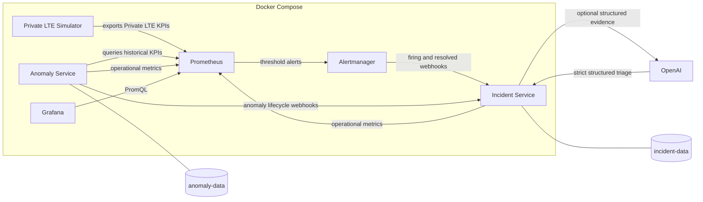

# Private LTE OSS Observability and Incident Operations

A simulated Private LTE OSS observability and incident-operations platform demonstrating KPI monitoring, threshold alerting, statistical anomaly detection, site/sector incident correlation, and evidence-grounded AI-assisted triage.

All sites, sectors, telemetry, alarms, failures, and incidents are synthetic. No customer or production network data is included. This is a portfolio and engineering demonstration environment, not a production OSS product.

## What This Demonstrates

- Private LTE operations concepts (sites, sectors, RF/RAN/transport/capacity KPIs)
- Telecom KPI analysis and failure-scenario injection
- Prometheus metric scraping, history, and threshold alert rules
- Alertmanager firing and resolved alert routing
- Grafana visualization for KPIs, incidents, anomalies, and AI triage
- Site/sector incident correlation across alarms and anomalies
- Statistical anomaly detection (MAD, robust z-score, EWMA)
- Python and FastAPI control-plane and operations services
- Linux containers and Docker Compose multi-service orchestration
- SQLite persistence for incident and anomaly state
- Evidence-grounded OpenAI triage with strict structured outputs
- Automated testing across simulator, incident, and anomaly suites

## Architecture

The platform contains six Docker Compose services:

1. Private LTE simulator
2. Prometheus
3. Alertmanager
4. Anomaly service
5. Incident service
6. Grafana



The incident service correlates alarms and anomalies by site and sector. Prometheus evaluates threshold alert rules before notifying Alertmanager.

Topology: three synthetic sites (`plte-site-101`, `plte-site-102`, `plte-site-103`), each with `sector-alpha`, `sector-beta`, and `sector-gamma` (nine sectors total).

### Private LTE Simulator

Python/FastAPI service that generates synthetic Private LTE sector KPIs and exposes Prometheus metrics plus failure-injection APIs.

- Three synthetic sites with sector-alpha, sector-beta, and sector-gamma
- KPIs: RSRP, RSRQ, SINR, downlink/uplink throughput, latency, packet loss, availability, active users, and handover success
- Supported failure scenarios: RF interference, backhaul degradation, cell outage, capacity congestion, and soft KPI drift
- Overlapping failures compose monotonically (worst wins): higher-is-better KPIs use `min`, lower-is-better KPIs use `max`
- Cell outage applies an absolute override after compositional faults and dominates other failures
- Soft drift alone keeps operating state `normal` so fixed warning thresholds are not tripped early

### Prometheus

- Scrapes the simulator, incident service, and anomaly service every 15 seconds
- Retains KPI and operational metric history with `site` and `sector` labels
- Evaluates Private LTE alert rules with worst-sample aggregation (`min by (site, sector)` or equivalent)
- Ten alert families with warning, major, and critical bands:

| Alert | Warning | Major | Critical | Domain |
|-------|---------|-------|----------|--------|
| `PLTECellOutage` | — | — | availability &lt; 5% for 30s | RAN |
| `PLTELowAvailability` | &lt; 99.5% for 2m | &lt; 98% for 1m | &lt; 95% for 30s | RAN |
| `PLTEPoorRSRP` | &lt; -95 dBm for 2m | &lt; -105 dBm for 1m | &lt; -110 dBm for 30s | RF |
| `PLTEPoorRSRQ` | &lt; -12 dB for 2m | &lt; -15 dB for 1m | &lt; -18 dB for 30s | RF |
| `PLTELowSINR` | &lt; 10 dB for 2m | &lt; 5 dB for 1m | &lt; 0 dB for 30s | RF |
| `PLTEHighLatency` | &gt; 40 ms for 2m | &gt; 80 ms for 1m | &gt; 120 ms for 30s | Transport |
| `PLTEHighPacketLoss` | &gt; 1% for 2m | &gt; 5% for 1m | &gt; 8% for 30s | Transport |
| `PLTEThroughputDegradation` | DL &lt; 50 or UL &lt; 15 for 2m | DL &lt; 20 or UL &lt; 5 for 1m | DL &lt; 10 or UL &lt; 3 for 30s | Capacity |
| `PLTEHandoverDegradation` | &lt; 97% for 2m | &lt; 90% for 1m | &lt; 75% for 30s | Mobility |
| `PLTECapacityCongestion` | users &gt; 100 for 2m | users &gt; 200 for 1m | users &gt; 250 for 30s | Capacity |

### Alertmanager

- Receives alerts from Prometheus
- Routes firing and resolved alerts to the incident service webhook at `http://incident:8080/webhooks/alertmanager`
- Groups by site, sector, alertname, and severity

### Anomaly Service

Statistical KPI anomaly detector (`hybrid-mad-ewma-v2`) that polls Prometheus per site, sector, and KPI.

- MAD-based robust scale and robust z-score scoring
- EWMA companion score; combined score uses `max(robust_z, ewma_score)`
- Guarded baseline: samples after `baseline_guard_sec` (default 60s) are excluded from the reference window used to score the current observation
- Baseline freeze while a series is warming up, active, or recovering
- Persistence (`persist_count`, default 3) before an anomaly becomes active
- Recovery lifecycle (`recover_count`, default 2) before clearing
- Soft KPI drift can raise statistical anomalies while SINR remains above the fixed `PLTELowSINR` warning threshold (&lt; 10 dB); soft drift holds SINR in about 11.8–12.2 dB
- Publishes anomaly lifecycle webhooks to the incident service and exposes its own Prometheus metrics
- Persists anomaly state in SQLite on the `anomaly-data` volume

### Incident Service

Python/FastAPI correlation service with SQLite persistence (`incident-data` volume).

- Correlates threshold alarms and statistical anomalies by site and sector into one open incident
- Lifecycle states: active, acknowledged, and cleared
- Severity escalation to the highest contributing alarm or anomaly band
- Probable fault domain derived from contributing evidence (RF, RAN, Transport, Capacity, Mobility, or Mixed)
- Complete evidence pack and lifecycle history
- REST API and Prometheus operational metrics
- Clears only after all contributing alarms resolve and all contributing anomalies clear
- Optional AI-assisted triage endpoint that does not mutate incident telemetry, severity, or lifecycle

### AI-Assisted Triage

- Optional OpenAI integration via `OPENAI_API_KEY` in the local `.env` file
- Strict JSON Schema / Pydantic Structured Outputs (`triage-v2`)
- Returns observed evidence, probable causes, recommended operator checks, limitations, and resolvable evidence references
- AI analysis cannot change incident telemetry, severity, or lifecycle
- Platform remains fully functional without an API key (`analyze` reports unavailable)
- Never commit or display a real API key

### Grafana

Three file-provisioned dashboards:

| Dashboard | UID | Local URL |
|-----------|-----|-----------|
| Private LTE OSS Observability | `private-lte-oss` | http://localhost:3000/d/private-lte-oss/private-lte-oss-observability |
| Private LTE Incident Operations | `private-lte-incidents` | http://localhost:3000/d/private-lte-incidents/private-lte-incident-operations |
| Private LTE Anomaly and AI Triage | `private-lte-anomaly-triage` | http://localhost:3000/d/private-lte-anomaly-triage/private-lte-anomaly-and-ai-triage |

Grafana queries Prometheus. Incident and anomaly SQLite data use persistent Docker volumes (`incident-data`, `anomaly-data`).

## Quick Start (Windows / PowerShell)

Requirements: Docker Desktop with Linux containers, Git, and free local ports `8000`, `8080`, `8081`, `9090`, `9093`, and `3000`.

```powershell
git clone https://github.com/plsmith67/telecom-oss-observability.git
cd .\telecom-oss-observability
Copy-Item .env.example .env
docker compose up --build
```

`OPENAI_API_KEY` is optional. If used, place it only in the ignored `.env` file. Do not commit `.env`. `.env.example` contains placeholders only.

### Local URLs

| Service | URL |
|---------|-----|
| Simulator API / docs | http://localhost:8000/docs |
| Simulator health | http://localhost:8000/health |
| Prometheus | http://localhost:9090 |
| Alertmanager | http://localhost:9093 |
| Incident API / docs | http://localhost:8080/docs |
| Anomaly API / docs | http://localhost:8081/docs |
| Grafana | http://localhost:3000 |
| Private LTE OSS Observability | http://localhost:3000/d/private-lte-oss/private-lte-oss-observability |
| Private LTE Incident Operations | http://localhost:3000/d/private-lte-incidents/private-lte-incident-operations |
| Private LTE Anomaly and AI Triage | http://localhost:3000/d/private-lte-anomaly-triage/private-lte-anomaly-and-ai-triage |

Local Grafana demonstration credentials: `admin` / `admin`. These are local demonstration credentials only and must be changed outside an isolated local environment.

### Stop and cleanup

Normal stop (preserves named volumes: incident, anomaly, and Alertmanager data):

```powershell
docker compose down
```

Destructive volume reset (deletes local named-volume state, including incident/anomaly SQLite databases and Alertmanager data):

```powershell
docker compose down -v
```

Warning: `docker compose down -v` permanently deletes local demonstration state stored in Docker volumes. Recreate with `docker compose up --build` afterward.

## Demo Workflow

End-to-end sequence for soft drift, statistical anomaly detection, threshold alarm correlation, optional AI triage, and recovery. Allow several minutes of normal operation first so Prometheus has a warm anomaly baseline (default `ANOMALY_MIN_SAMPLES=20`).

1. Establish a normal KPI baseline (no injected failures).

```powershell
Invoke-RestMethod http://localhost:8000/failures
Invoke-RestMethod http://localhost:8000/api/v1/sectors | Select-Object -First 1
```

2. Apply soft KPI drift to `plte-site-103` / `sector-gamma`.

```powershell
Invoke-RestMethod -Method Post -Uri http://localhost:8000/failures/soft-kpi-drift `
  -ContentType 'application/json' `
  -Body '{"site":"plte-site-103","sector":"sector-gamma"}'
```

3. Show statistical anomaly detection while SINR remains above the fixed warning threshold (`PLTELowSINR` warning is &lt; 10 dB; soft drift holds SINR in about 11.8–12.2 dB). Wait for persistence (about 45 seconds after the series is warm).

```powershell
Invoke-RestMethod 'http://localhost:8081/api/v1/anomalies?state=active'
Invoke-RestMethod 'http://localhost:8080/api/v1/incidents?site=plte-site-103'
```

4. Add RF interference without removing soft drift.

```powershell
Invoke-RestMethod -Method Post -Uri http://localhost:8000/failures/rf-interference `
  -ContentType 'application/json' `
  -Body '{"site":"plte-site-103","sector":"sector-gamma"}'
```

5. Show `PLTELowSINR` transition from pending to firing in Prometheus (http://localhost:9090/alerts) after the rule `for` duration.

6. Show alarms and anomalies correlated into one incident for the same site and sector.

```powershell
Invoke-RestMethod 'http://localhost:8080/api/v1/incidents?site=plte-site-103'
```

7. Run optional AI-assisted triage (requires `OPENAI_API_KEY` in `.env`; otherwise the API reports unavailable).

```powershell
$incident = (Invoke-RestMethod 'http://localhost:8080/api/v1/incidents?site=plte-site-103')[0]
Invoke-RestMethod -Method Post -Uri "http://localhost:8080/api/v1/incidents/$($incident.id)/analyze"
```

8. Clear RF interference while leaving soft drift active (delete only the RF failure id):

```powershell
$failures = Invoke-RestMethod http://localhost:8000/failures
$rf = $failures | Where-Object { $_.failure_type -eq 'rf_interference' }
foreach ($f in $rf) {
  Invoke-RestMethod -Method Delete -Uri "http://localhost:8000/failures/$($f.id)"
}
```

9. Verify the incident remains open while anomaly evidence remains (threshold alarms may resolve while soft-drift anomalies are still active).

```powershell
Invoke-RestMethod 'http://localhost:8080/api/v1/incidents?site=plte-site-103'
Invoke-RestMethod 'http://localhost:8081/api/v1/anomalies?state=active'
```

10. Clear soft drift (or clear all remaining failures).

```powershell
Invoke-RestMethod -Method Delete -Uri http://localhost:8000/failures
```

11. Verify anomalies recover and the incident clears after contributing alarms resolve and anomalies clear.

```powershell
Invoke-RestMethod 'http://localhost:8081/api/v1/anomalies'
Invoke-RestMethod 'http://localhost:8080/api/v1/incidents?site=plte-site-103'
```

### Additional failure examples

```powershell
Invoke-RestMethod -Method Post -Uri http://localhost:8000/failures/backhaul-degradation `
  -ContentType 'application/json' `
  -Body '{"site":"plte-site-102","sector":"sector-beta"}'

Invoke-RestMethod -Method Post -Uri http://localhost:8000/failures/cell-outage `
  -ContentType 'application/json' `
  -Body '{"site":"plte-site-103","sector":"sector-gamma"}'

Invoke-RestMethod -Method Post -Uri http://localhost:8000/failures/capacity-congestion `
  -ContentType 'application/json' `
  -Body '{"site":"plte-site-101"}'
```

Omitting `sector` applies the failure to every sector at the site.

## API Summary

### Simulator

| Method | Path | Description |
|--------|------|-------------|
| GET | `/health` | Liveness |
| GET | `/ready` | Readiness |
| GET | `/metrics` | Prometheus exposition |
| GET | `/api/v1/topology` | Sites and sectors |
| GET | `/api/v1/sectors` | Current KPI snapshot |
| GET | `/failures` | List active injected failures |
| POST | `/failures/rf-interference` | Inject RF interference |
| POST | `/failures/backhaul-degradation` | Inject backhaul degradation |
| POST | `/failures/cell-outage` | Inject cell outage |
| POST | `/failures/capacity-congestion` | Inject capacity congestion |
| POST | `/failures/soft-kpi-drift` | Inject sub-warning soft drift |
| DELETE | `/failures/{id}` | Clear one failure |
| DELETE | `/failures` | Clear all failures |

Failure request body:

```json
{ "site": "plte-site-101", "sector": "sector-alpha" }
```

### Incident service

| Method | Path | Purpose |
|--------|------|---------|
| GET | `/health` | Liveness |
| GET | `/ready` | Database readiness |
| POST | `/webhooks/alertmanager` | Ingest Alertmanager alerts |
| POST | `/webhooks/anomalies` | Ingest statistical anomaly events |
| GET | `/api/v1/incidents` | List (`state`, `site`, `severity`) |
| GET | `/api/v1/incidents/{id}` | Detail |
| GET | `/api/v1/incidents/{id}/alarms` | Contributing threshold alarms |
| GET | `/api/v1/incidents/{id}/anomalies` | Contributing anomalies |
| GET | `/api/v1/incidents/{id}/evidence` | Unified evidence pack |
| GET | `/api/v1/incidents/{id}/history` | Lifecycle history |
| POST | `/api/v1/incidents/{id}/acknowledge` | Acknowledge an active incident |
| POST | `/api/v1/incidents/{id}/analyze` | Optional AI triage |
| GET | `/api/v1/incidents/{id}/analyses` | Stored AI analysis history |

### Anomaly service

| Method | Path | Purpose |
|--------|------|---------|
| GET | `/health` | Liveness |
| GET | `/ready` | DB + Prometheus reachability |
| GET | `/metrics` | Anomaly gauges for Grafana |
| GET | `/api/v1/anomalies` | List anomalies |
| GET | `/api/v1/anomalies/{id}` | Detail + sample window |
| POST | `/api/v1/evaluate` | Run one evaluation cycle |

## Validation

| Suite | Result |
|---|---:|
| Incident service | 32 passed |
| Anomaly service | 20 passed |
| Simulator | 30 passed |
| Total | 82 passed |
| Docker Compose configuration | Valid |
| Services | Six healthy |

Milestone tags:

- `phase-1-observability`
- `phase-2-incident-operations`
- `phase-3-anomaly-ai-triage`

### Running the test suites

```powershell
cd .\simulator
python -m venv .venv
.\.venv\Scripts\Activate.ps1
pip install -r requirements.txt
pytest

cd ..\incident
python -m venv .venv
.\.venv\Scripts\Activate.ps1
pip install -r requirements.txt
pytest

cd ..\anomaly
python -m venv .venv
.\.venv\Scripts\Activate.ps1
pip install -r requirements.txt
pytest
```

On Linux hosts, use `source .venv/bin/activate` instead of the PowerShell activate script.

## Screenshots

Validated Grafana dashboard images will be added separately.

## Security and Limitations

- Synthetic data only; no customer or production network telemetry
- Secrets are loaded through environment variables
- `.env` is gitignored; `.env.example` contains placeholders only
- No real OSS/EMS credentials are used or required
- No customer data is present in the repository
- No authentication, TLS, high availability, or production hardening
- SQLite is suitable for this demonstration but is not the proposed production persistence architecture
- OpenAI integration is optional and evidence-bound; human review remains required for operational recommendations
- The project does not automatically make changes to a real network
- Local Grafana `admin` / `admin` credentials are for isolated local demonstration only

## Project Layout

```
telecom-oss-observability/
├── docker-compose.yml
├── .env.example
├── LICENSE
├── README.md
├── simulator/                 # FastAPI KPI simulator + pytest
├── anomaly/                   # Statistical KPI anomaly detector
├── incident/                  # Alarm/anomaly correlation + optional AI triage
├── prometheus/                # Scrape config + Private LTE alert rules
├── alertmanager/              # Webhook routing to the incident service
└── grafana/                   # Provisioned dashboards and datasource
```

## Troubleshooting

**Ports already in use**  
Stop conflicting services or change host port mappings in `docker-compose.yml`.

**Prometheus target DOWN**  
Open http://localhost:9090/targets and confirm `simulator:8000`, `incident:8080`, and `anomaly:8081` are up (`docker compose ps`).

**Anomalies do not appear**  
The detector needs a warm guarded baseline and `persist_count` consecutive exceedances. Soft drift must run after warm-up. Check http://localhost:8081/api/v1/anomalies and anomaly service logs.

**Alerts do not appear**  
Rules need their `for` duration. Check http://localhost:9090/alerts and http://localhost:9093/#/alerts. The incident service must be healthy before Alertmanager starts.

**Grafana shows no data**  
Wait about 30 seconds after startup for the first scrapes. Confirm the Prometheus datasource and use Site / Sector filters.

**Stuck in a failure state**

```powershell
Invoke-RestMethod -Method Delete -Uri http://localhost:8000/failures
```

## License

This project is released under the MIT License. See [LICENSE](LICENSE).

Copyright (c) 2026 Phillip L. Smith

Prometheus, Alertmanager, Grafana, FastAPI, OpenAI client libraries, and other third-party dependencies remain subject to their respective licenses.
