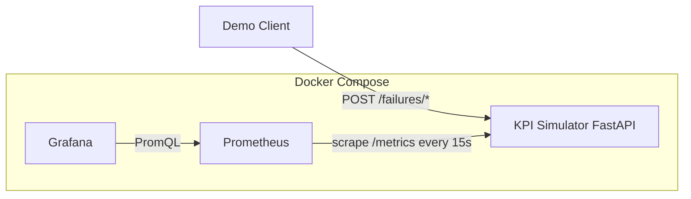

# Telecom OSS Observability — Private LTE (Phase 1)

Portfolio-quality observability platform that simulates Private LTE radio KPIs, scrapes them with Prometheus, and visualizes network health in a provisioned Grafana dashboard. Failures (RF interference, backhaul degradation, cell outage, capacity congestion) can be injected through a FastAPI control plane for live demos.

## Architecture



| Component | Role |
|-----------|------|
| **Simulator** | FastAPI service generating realistic sector KPIs and Prometheus metrics |
| **Prometheus** | Scrapes `/metrics` from the simulator (official `prom/prometheus` image) |
| **Grafana** | Auto-provisioned datasource + Private LTE OSS dashboard |

### Topology

Three sites × three sectors (nine sectors total). Site IDs are unchanged; every site has the same sector set:

| Site | Sectors |
|------|---------|
| `plte-site-101` | Sector Alpha (`sector-alpha`), Sector Beta (`sector-beta`), Sector Gamma (`sector-gamma`) |
| `plte-site-102` | Sector Alpha (`sector-alpha`), Sector Beta (`sector-beta`), Sector Gamma (`sector-gamma`) |
| `plte-site-103` | Sector Alpha (`sector-alpha`), Sector Beta (`sector-beta`), Sector Gamma (`sector-gamma`) |

Each sector reports: RSRP, RSRQ, SINR, DL/UL throughput, packet loss, latency, availability, active users, and handover success rate. Operating state is `normal`, `degraded`, or `critical`.

## Quick start

**Requirements:** Docker Engine with Compose v2, ports `8000`, `9090`, and `3000` free.

```bash
docker compose up --build
```

Wait until all services report healthy, then open the URLs below.

Stop the stack:

```bash
docker compose down
```

## Service URLs

| Service | URL | Credentials |
|---------|-----|-------------|
| Simulator API / docs | http://localhost:8000/docs | — |
| Simulator health | http://localhost:8000/health | — |
| Prometheus metrics | http://localhost:8000/metrics | — |
| Prometheus UI | http://localhost:9090 | — |
| Grafana | http://localhost:3000 | `admin` / `admin` |
| Dashboard | http://localhost:3000/d/private-lte-oss/private-lte-oss-observability | `admin` / `admin` |

## Demo scenarios

Reset any prior incidents first:

```bash
curl -X DELETE http://localhost:8000/failures
```

### 1. RF interference (degraded RF KPIs)

```bash
curl -s -X POST http://localhost:8000/failures/rf-interference \
  -H 'Content-Type: application/json' \
  -d '{"site":"plte-site-101","sector":"sector-alpha"}' | jq
```

Watch SINR / RSRP drop on the Grafana dashboard (filter Site=`plte-site-101`, Sector=`sector-alpha` / Sector Alpha).

### 2. Backhaul degradation (latency & packet loss)

```bash
curl -s -X POST http://localhost:8000/failures/backhaul-degradation \
  -H 'Content-Type: application/json' \
  -d '{"site":"plte-site-102","sector":"sector-beta"}' | jq
```

### 3. Cell outage on Sector Gamma (critical)

```bash
curl -s -X POST http://localhost:8000/failures/cell-outage \
  -H 'Content-Type: application/json' \
  -d '{"site":"plte-site-103","sector":"sector-gamma"}' | jq
```

Availability approaches 0% on `plte-site-103` / Sector Gamma; Active Incidents panel shows the outage.

### 4. Capacity congestion (site-wide)

```bash
curl -s -X POST http://localhost:8000/failures/capacity-congestion \
  -H 'Content-Type: application/json' \
  -d '{"site":"plte-site-101"}' | jq
```

Omitting `sector` applies the failure to every sector at the site.

### 5. Inspect and clear

```bash
curl -s http://localhost:8000/failures | jq
curl -s http://localhost:8000/api/v1/sectors | jq
curl -X DELETE http://localhost:8000/failures
```

## API reference (control plane)

| Method | Path | Description |
|--------|------|-------------|
| GET | `/health` | Liveness |
| GET | `/ready` | Readiness |
| GET | `/metrics` | Prometheus exposition |
| GET | `/api/v1/topology` | Sites and sectors |
| GET | `/api/v1/sectors` | Current KPI snapshot (JSON) |
| GET | `/failures` | List active incidents |
| POST | `/failures/rf-interference` | Inject RF interference |
| POST | `/failures/backhaul-degradation` | Inject backhaul issue |
| POST | `/failures/cell-outage` | Inject sector / cell outage |
| POST | `/failures/capacity-congestion` | Inject congestion |
| DELETE | `/failures/{id}` | Clear one incident |
| DELETE | `/failures` | Clear all incidents |

Failure request body:

```json
{ "site": "plte-site-101", "sector": "sector-alpha" }
```

`sector` is optional; when omitted the failure applies to all sectors at the site. Valid sector IDs: `sector-alpha`, `sector-beta`, `sector-gamma`.

Prometheus metrics use labels `site`, `sector`, and `state` (for example `sector="sector-gamma"`).

## Running tests

```bash
cd simulator
python3.12 -m venv .venv
source .venv/bin/activate
pip install -r requirements.txt
pytest
```

## Project layout

```
telecom-oss-observability/
├── docker-compose.yml
├── simulator/                 # FastAPI KPI simulator + pytest
├── prometheus/                # Official Prometheus image + scrape config
├── grafana/                   # Official Grafana image + provisioning
│   ├── dashboards/
│   └── provisioning/
└── README.md
```

## Thresholds (dashboard)

| KPI | Warning | Critical |
|-----|---------|----------|
| Availability | &lt; 99% | &lt; 95% |
| SINR | &lt; 10 dB | &lt; 5 dB |
| Latency | ≥ 40 ms | ≥ 120 ms |
| Packet loss | ≥ 1% | ≥ 8% |
| Active incidents | ≥ 1 | ≥ 2 |

## Troubleshooting

**Ports already in use**  
Stop conflicting services or change host port mappings in `docker-compose.yml`.

**Prometheus target DOWN**  
Open http://localhost:9090/targets and confirm `simulator:8000` is up. Ensure the simulator health check passed (`docker compose ps`).

**Grafana shows no data**  
Wait ~30s after startup for the first scrapes. Confirm the Prometheus datasource at Connections → Data sources. Dashboard refresh is 15s. Use Site filters (`plte-site-101`, `plte-site-102`, `plte-site-103`) and Sector filters (`sector-alpha`, `sector-beta`, `sector-gamma`).

**Dashboard missing after restart**  
Dashboards are file-provisioned from `grafana/dashboards/`. Rebuild Grafana if you edited JSON: `docker compose up --build -d grafana`.

**Stuck in a failure state**  
`curl -X DELETE http://localhost:8000/failures`

**Rebuild from scratch**

```bash
docker compose down -v
docker compose up --build
```

## License

Demo / portfolio project — use freely for learning and interviews.
