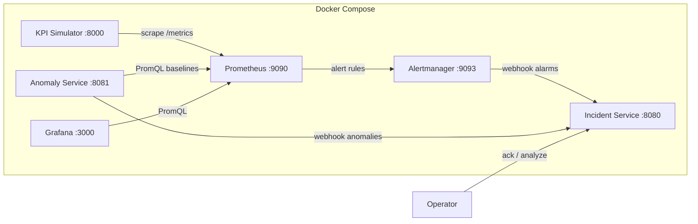

# Telecom OSS Observability — Private LTE

Portfolio-quality observability platform for Private LTE operations. Phase 1 simulates sector KPIs and visualizes them in Grafana. Phase 2 adds Prometheus alert rules, Alertmanager, and an incident service that correlates alarms into operational incidents. Phase 3 adds statistical KPI anomaly detection and optional evidence-grounded AI incident triage.

This stack uses deterministic rules, transparent hybrid statistics, and optional LLM assistance over stored evidence. It is **not** predictive maintenance, root-cause certainty, autonomous operations, or a production-ready OSS.

## Architecture



| Component | Role |
|-----------|------|
| **Simulator** | FastAPI service generating realistic sector KPIs and Prometheus metrics |
| **Prometheus** | Scrapes simulator, incident, and anomaly services; evaluates Private LTE alert rules |
| **Alertmanager** | Routes firing and resolved alerts to the incident webhook |
| **Anomaly service** | Rolling MAD / robust z-score / EWMA detector per site, sector, and KPI |
| **Incident service** | Correlates threshold alarms and statistical anomalies; optional OpenAI triage |
| **Grafana** | KPI, incident operations, and anomaly/AI triage dashboards |

### Topology

Three sites × three sectors (nine sectors total). Site IDs are unchanged; every site has the same sector set:

| Site | Sectors |
|------|---------|
| `plte-site-101` | Sector Alpha (`sector-alpha`), Sector Beta (`sector-beta`), Sector Gamma (`sector-gamma`) |
| `plte-site-102` | Sector Alpha (`sector-alpha`), Sector Beta (`sector-beta`), Sector Gamma (`sector-gamma`) |
| `plte-site-103` | Sector Alpha (`sector-alpha`), Sector Beta (`sector-beta`), Sector Gamma (`sector-gamma`) |

Each sector reports: RSRP, RSRQ, SINR, DL/UL throughput, packet loss, latency, availability, active users, and handover success rate. Operating state is `normal`, `degraded`, or `critical`.

## Quick start

**Requirements:** Docker Engine with Compose v2, ports `8000`, `8080`, `8081`, `9090`, `9093`, and `3000` free.

```bash
docker compose up --build
```

Wait until all services report healthy, then open the URLs below.

Stop the stack:

```bash
docker compose down
```

## Service URLs

| Service | URL | Credentials |
|---------|-----|-------------|
| Simulator API / docs | http://localhost:8000/docs | — |
| Simulator health | http://localhost:8000/health | — |
| Prometheus metrics | http://localhost:8000/metrics | — |
| Prometheus UI | http://localhost:9090 | — |
| Grafana | http://localhost:3000 | `admin` / `admin` |
| KPI dashboard | http://localhost:3000/d/private-lte-oss/private-lte-oss-observability | `admin` / `admin` |
| Incident dashboard | http://localhost:3000/d/private-lte-incidents/private-lte-incident-operations | `admin` / `admin` |
| Anomaly / AI triage dashboard | http://localhost:3000/d/private-lte-anomaly-triage/private-lte-anomaly-and-ai-triage | `admin` / `admin` |
| Alertmanager | http://localhost:9093 | — |
| Incident API / docs | http://localhost:8080/docs | — |
| Incident health | http://localhost:8080/health | — |
| Anomaly API / docs | http://localhost:8081/docs | — |
| Anomaly health | http://localhost:8081/health | — |

## Demo scenarios

Reset any prior incidents first:

```bash
curl -X DELETE http://localhost:8000/failures
```

### 1. RF interference (degraded RF KPIs)

```bash
curl -s -X POST http://localhost:8000/failures/rf-interference \
  -H 'Content-Type: application/json' \
  -d '{"site":"plte-site-101","sector":"sector-alpha"}' | jq
```

Watch SINR / RSRP drop on the Grafana dashboard (filter Site=`plte-site-101`, Sector=`sector-alpha` / Sector Alpha).

### 2. Backhaul degradation (latency & packet loss)

```bash
curl -s -X POST http://localhost:8000/failures/backhaul-degradation \
  -H 'Content-Type: application/json' \
  -d '{"site":"plte-site-102","sector":"sector-beta"}' | jq
```

### 3. Cell outage on Sector Gamma (critical)

```bash
curl -s -X POST http://localhost:8000/failures/cell-outage \
  -H 'Content-Type: application/json' \
  -d '{"site":"plte-site-103","sector":"sector-gamma"}' | jq
```

Availability approaches 0% on `plte-site-103` / Sector Gamma; Active Incidents panel shows the outage.

### 4. Capacity congestion (site-wide)

```bash
curl -s -X POST http://localhost:8000/failures/capacity-congestion \
  -H 'Content-Type: application/json' \
  -d '{"site":"plte-site-101"}' | jq
```

Omitting `sector` applies the failure to every sector at the site.

### Overlapping failure composition

Multiple failures on the same sector compose **monotonically** (worst wins). Adding a failure never improves an already-degraded KPI.

| KPI direction | Composition |
|---------------|-------------|
| Higher is better (RSRP, RSRQ, SINR, availability, DL/UL throughput, handover success) | `min(current, proposed)` |
| Lower is better (latency, packet loss, active users as congestion) | `max(current, proposed)` |

Operating state uses the highest active severity: `normal` &lt; `degraded` &lt; `critical`. Soft drift alone stays `normal` so Phase 2 static warnings do not trip early; combining soft drift with RF interference yields `degraded` and SINR in the RF critical band (below 10 dB), so `PLTELowSINR` can fire while soft drift remains applied. Cell outage applies an absolute override and dominates every other failure.

### 5. Inspect and clear

```bash
curl -s http://localhost:8000/failures | jq
curl -s http://localhost:8000/api/v1/sectors | jq
curl -X DELETE http://localhost:8000/failures
```

## API reference (control plane)

| Method | Path | Description |
|--------|------|-------------|
| GET | `/health` | Liveness |
| GET | `/ready` | Readiness |
| GET | `/metrics` | Prometheus exposition |
| GET | `/api/v1/topology` | Sites and sectors |
| GET | `/api/v1/sectors` | Current KPI snapshot (JSON) |
| GET | `/failures` | List active incidents |
| POST | `/failures/rf-interference` | Inject RF interference |
| POST | `/failures/backhaul-degradation` | Inject backhaul issue |
| POST | `/failures/cell-outage` | Inject sector / cell outage |
| POST | `/failures/capacity-congestion` | Inject congestion |
| DELETE | `/failures/{id}` | Clear one incident |
| DELETE | `/failures` | Clear all incidents |

Failure request body:

```json
{ "site": "plte-site-101", "sector": "sector-alpha" }
```

`sector` is optional; when omitted the failure applies to all sectors at the site. Valid sector IDs: `sector-alpha`, `sector-beta`, `sector-gamma`.

Prometheus metrics use labels `site`, `sector`, and `state` (for example `sector="sector-gamma"`).

## Running tests

```bash
cd simulator
python3.12 -m venv .venv
source .venv/bin/activate
pip install -r requirements.txt
pytest
```

```bash
cd incident
python3.12 -m venv .venv
source .venv/bin/activate
pip install -r requirements.txt
pytest
```

```bash
cd anomaly
python3.12 -m venv .venv
source .venv/bin/activate
pip install -r requirements.txt
pytest
```

## Project layout

```
telecom-oss-observability/
├── docker-compose.yml
├── .env.example               # Optional OPENAI_* and anomaly overrides
├── simulator/                 # FastAPI KPI simulator + pytest
├── anomaly/                   # Statistical KPI anomaly detector
├── incident/                  # Alarm/anomaly correlation + optional AI triage
├── prometheus/                # Scrape config + Private LTE alert rules
├── alertmanager/              # Webhook routing to the incident service
├── grafana/                   # KPI, incident, and anomaly dashboards
└── README.md
```

## Phase 2 alerting

Prometheus evaluates rules in `prometheus/alerts/plte_alerts.yml` every 15 seconds. Each rule is per `site` and `sector`. Severity is `warning`, `major`, or `critical`.

| Alert | Warning | Major | Critical | Domain |
|-------|---------|-------|----------|--------|
| `PLTECellOutage` | — | — | availability &lt; 5% for 30s | RAN |
| `PLTELowAvailability` | &lt; 99.5% for 2m | &lt; 98% for 1m | &lt; 95% for 30s | RAN |
| `PLTEPoorRSRP` | &lt; -95 dBm for 2m | &lt; -105 dBm for 1m | &lt; -110 dBm for 30s | RF |
| `PLTEPoorRSRQ` | &lt; -12 dB for 2m | &lt; -15 dB for 1m | &lt; -18 dB for 30s | RF |
| `PLTELowSINR` | &lt; 10 dB for 2m | &lt; 5 dB for 1m | &lt; 0 dB for 30s | RF |
| `PLTEHighLatency` | &gt; 40 ms for 2m | &gt; 80 ms for 1m | &gt; 120 ms for 30s | Transport |
| `PLTEHighPacketLoss` | &gt; 1% for 2m | &gt; 5% for 1m | &gt; 8% for 30s | Transport |
| `PLTEThroughputDegradation` | DL &lt; 50 or UL &lt; 15 for 2m | DL &lt; 20 or UL &lt; 5 for 1m | DL &lt; 10 or UL &lt; 3 for 30s | Capacity |
| `PLTEHandoverDegradation` | &lt; 97% for 2m | &lt; 90% for 1m | &lt; 75% for 30s | Mobility |
| `PLTECapacityCongestion` | users &gt; 100 for 2m | users &gt; 200 for 1m | users &gt; 250 for 30s | Capacity |

Cell outage is critical only. Low availability covers degraded availability that is not a full outage.

### Incident workflow

1. Prometheus fires an alert after its `for` duration.
2. Alertmanager posts the alert, including later resolves, to `POST /webhooks/alertmanager`.
3. The incident service keeps one open incident per `(site, sector)` and retains every contributing alarm.
4. Incident severity is the highest firing alarm (`warning` &lt; `major` &lt; `critical`).
5. `POST /api/v1/incidents/{id}/acknowledge` moves `active` to `acknowledged`. Cleared incidents return `409`.
6. When every contributing **alarm** is resolved **and** every contributing **anomaly** is cleared, the incident becomes `cleared`.

Incident fields: id, site, sector, severity, lifecycle state, probable domain, first detected, last updated, cleared time, acknowledgement, contributing alarms, contributing anomalies, and affected KPIs.

| Method | Path | Purpose |
|--------|------|---------|
| GET | `/health` | Liveness |
| GET | `/ready` | Database readiness |
| POST | `/webhooks/alertmanager` | Ingest Alertmanager alerts |
| POST | `/webhooks/anomalies` | Ingest statistical anomaly events |
| GET | `/api/v1/incidents` | List (`state`, `site`, `severity`) |
| GET | `/api/v1/incidents/{id}` | Detail |
| GET | `/api/v1/incidents/{id}/alarms` | Contributing threshold alarms |
| GET | `/api/v1/incidents/{id}/anomalies` | Contributing anomalies |
| GET | `/api/v1/incidents/{id}/evidence` | Unified evidence pack |
| GET | `/api/v1/incidents/{id}/history` | Lifecycle history |
| POST | `/api/v1/incidents/{id}/acknowledge` | Acknowledge an active incident |
| POST | `/api/v1/incidents/{id}/analyze` | Optional AI triage |
| GET | `/api/v1/incidents/{id}/analyses` | Stored AI analysis history |

### Repeatable incident demonstration

Trigger a cell outage, wait about 45 seconds for the 30-second critical rule, then inspect and acknowledge.

```bash
curl -s -X POST http://localhost:8000/failures/cell-outage \
  -H 'Content-Type: application/json' \
  -d '{"site":"plte-site-103","sector":"sector-gamma"}'

curl -s http://localhost:9090/api/v1/alerts | jq '.data.alerts[].labels.alertname'
curl -s http://localhost:8080/api/v1/incidents | jq
INCIDENT=$(curl -s http://localhost:8080/api/v1/incidents | jq -r '.[0].id')
curl -s -X POST "http://localhost:8080/api/v1/incidents/${INCIDENT}/acknowledge" \
  -H 'Content-Type: application/json' \
  -d '{"acknowledged_by":"noc-operator"}' | jq

curl -X DELETE http://localhost:8000/failures
```

After the failure is cleared and Prometheus resolves the alert, the incident lifecycle becomes `cleared`. Open the incident dashboard and filter Site to `plte-site-103`.

## Phase 3 anomaly detection and AI triage

The anomaly service polls Prometheus for per-`(site, sector, kpi)` series and scores the latest observation against a **protected** median / MAD baseline. Detector version: `hybrid-mad-ewma-v2`.

### Baseline, observation, and guard interval

| Concept | Behavior |
|---------|----------|
| **Baseline window** | Rolling history used for median / MAD (default `30m`) |
| **Guard interval** | `baseline_guard_sec` (default `60`) gap between baseline end and the observation timestamp so current drift samples do not enter the reference used to score them |
| **Observation** | Latest scraped sample only |
| **Baseline freeze** | While a series is `warming_up` / `active` / `recovering`, median and σ stay frozen at the values captured when the candidate opened so degradation cannot retrain itself away |

Query lookback is `baseline_window + baseline_guard_sec`. Only samples with `ts <= observation_ts - guard` contribute to median / MAD unless the series is already frozen.

### Score formula

```
σ = max(1.4826 × MAD(baseline), ε)
robust_z   = direction_score((x − median) / σ)   # >0 means worse for the KPI
ewma_score = direction_score((x − ewma_prev) / σ)
combined_score = max(robust_z, ewma_score)
is_candidate = (robust_z > 0) and (combined_score ≥ threshold)
```

Component scales are dimensionless multiples of σ. Using `max` keeps a strong robust-z or EWMA signal from being diluted by a weak companion. Candidates still require `robust_z > 0`.

### Persistence and per-KPI sensitivity

| Setting | Default |
|---------|---------|
| Poll interval | 15s |
| Baseline window | 30m |
| Baseline guard | 60s |
| Minimum baseline samples | 20 |
| Persist count | 3 consecutive candidates → `active` |
| Recover count | 2 consecutive non-candidates → clear |
| Global score threshold | 3.5 (per-KPI overrides apply; SINR uses **3.0**) |

Anomalies are **not** Phase 2 threshold alerts. Soft KPI drift holds SINR in **11.8–12.2 dB** (above warning `< 10`) so `PLTELowSINR` stays inactive while the detector can still fire on a clean ~19 dB baseline.

### Soft-drift then threshold correlation demo

1. Let the stack warm so Prometheus has baseline history (about 5+ minutes with default `ANOMALY_MIN_SAMPLES=20`).
2. Inject soft drift (sub-warning RF/transport bias):

```bash
curl -s -X POST http://localhost:8000/failures/soft-kpi-drift \
  -H 'Content-Type: application/json' \
  -d '{"site":"plte-site-103","sector":"sector-gamma"}'
```

3. Wait for persistence (about 45s after the series is warm), then inspect:

```bash
curl -s http://localhost:8081/api/v1/anomalies?state=active | jq
curl -s http://localhost:8080/api/v1/incidents | jq
```

4. Escalate into a Phase 2 warning/major band so a threshold alarm joins the **same** incident:

```bash
curl -s -X POST http://localhost:8000/failures/rf-interference \
  -H 'Content-Type: application/json' \
  -d '{"site":"plte-site-103","sector":"sector-gamma"}'
```

5. Optional AI triage (requires `OPENAI_API_KEY` in the environment; otherwise returns `unavailable`):

```bash
INCIDENT=$(curl -s 'http://localhost:8080/api/v1/incidents?site=plte-site-103' | jq -r '.[0].id')
curl -s -X POST "http://localhost:8080/api/v1/incidents/${INCIDENT}/analyze" | jq
```

6. Clear and confirm recovery:

```bash
curl -X DELETE http://localhost:8000/failures
```

Copy `.env.example` to `.env` for optional OpenAI settings. Never commit API keys. When no key is configured, anomaly detection and incident operations continue; the analyze API and Grafana AI panels report that AI analysis is unavailable. Rule-based summaries are never labeled as AI-generated analysis.

### Anomaly service API

| Method | Path | Purpose |
|--------|------|---------|
| GET | `/health` | Liveness |
| GET | `/ready` | DB + Prometheus reachability |
| GET | `/metrics` | Anomaly gauges for Grafana |
| GET | `/api/v1/anomalies` | List anomalies |
| GET | `/api/v1/anomalies/{id}` | Detail + sample window |
| POST | `/api/v1/evaluate` | Run one evaluation cycle |

## Thresholds (dashboard)

| KPI | Warning | Critical |
|-----|---------|----------|
| Availability | &lt; 99% | &lt; 95% |
| SINR | &lt; 10 dB | &lt; 5 dB |
| Latency | ≥ 40 ms | ≥ 120 ms |
| Packet loss | ≥ 1% | ≥ 8% |
| Active incidents | ≥ 1 | ≥ 2 |

## Troubleshooting

**Ports already in use**  
Stop conflicting services or change host port mappings in `docker-compose.yml`.

**Prometheus target DOWN**  
Open http://localhost:9090/targets and confirm `simulator:8000`, `incident:8080`, and `anomaly:8081` are up. Ensure health checks passed (`docker compose ps`).

**Anomalies do not appear**  
The detector needs a warm **guarded** baseline (`ANOMALY_MIN_SAMPLES`, default 20 samples ending before `ANOMALY_BASELINE_GUARD_SEC`) and `persist_count` consecutive exceedances. Soft drift must run after warm-up and uses a narrow SINR band (11.8–12.2 dB). Check http://localhost:8081/api/v1/anomalies and anomaly service logs.
**Alerts do not appear**  
Rules need their `for` duration (30 seconds for critical cell outage). Check http://localhost:9090/alerts and http://localhost:9093/#/alerts. The incident service must be healthy before Alertmanager starts.

**Grafana shows no data**  
Wait ~30s after startup for the first scrapes. Confirm the Prometheus datasource at Connections → Data sources. Dashboard refresh is 15s. Use Site filters (`plte-site-101`, `plte-site-102`, `plte-site-103`) and Sector filters (`sector-alpha`, `sector-beta`, `sector-gamma`).

**Dashboard missing after restart**  
Dashboards are file-provisioned from `grafana/dashboards/`. Rebuild Grafana if you edited JSON: `docker compose up --build -d grafana`.

**Stuck in a failure state**  
`curl -X DELETE http://localhost:8000/failures`

**Rebuild from scratch**

```bash
docker compose down -v
docker compose up --build
```

## License

Demo / portfolio project — use freely for learning and interviews.
